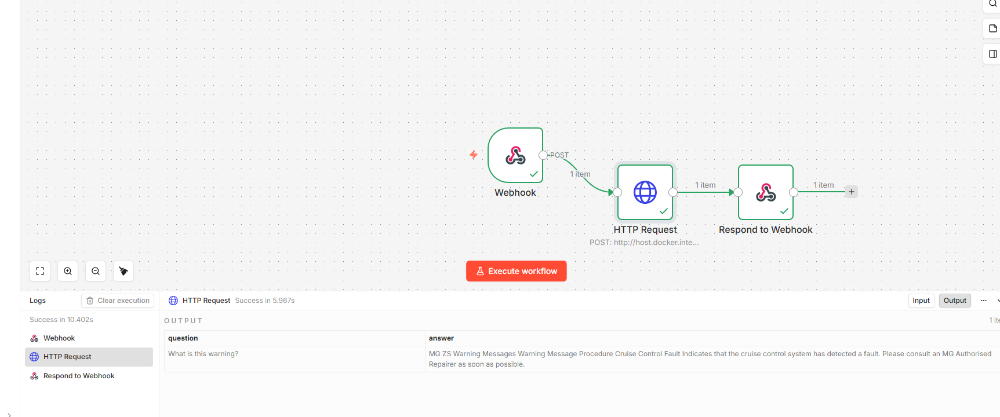

# RAG Car Manual Assistant

### Overview

This project implements a fully open-source Retrieval-Augmented Generation (RAG) system for document-grounded question answering over automotive manuals.
The system retrieves relevant sections from vehicle warning documentation and generates grounded, concise answers using transformer-based language models.

The project is designed as a research-oriented prototype, emphasizing modularity, robustness, reproducibility, and trustworthy AI principles.

### Motivation

Large Language Models (LLMs) often hallucinate when answering factual questions.
Retrieval-Augmented Generation mitigates this limitation by grounding model outputs in external knowledge sources.

This project explores:

- Document-grounded reasoning
- Semantic retrieval using embeddings
- Trustworthy and explainable LLM outputs
- Open-source alternatives to proprietary APIs

### System Architecture

The pipeline follows a standard RAG workflow:

- Document Loading – Automotive manual content is loaded and parsed
- Text Splitting – Documents are chunked into semantically meaningful segments
- Embedding Generation – Text chunks are embedded using a transformer-based sentence embedding model
- Vector Storage – Embeddings are stored in a local FAISS vector database
- Retrieval – Relevant document chunks are retrieved for a given query
- Generation – A sequence-to-sequence language model generates grounded answers

### Technologies Used
Core Libraries

- Python 3.10+
- LangChain (community integrations)
- Hugging Face Transformers
- Sentence-Transformers
- FAISS (vector similarity search)

### Models

- Embeddings: sentence-transformers/all-MiniLM-L6-v2
- Generator: google/flan-t5-base
- Engineering Practices
- Modular project structure
- Custom exception hierarchy
- Centralized logging
- Virtual environment isolation


### System Output
`Please consult an MG Authorised Repairer as soon as possible.`

Interpretation

The system retrieves the most relevant section of the vehicle manual corresponding to the queried warning message.
In this case, the documentation explicitly instructs the driver to consult an authorized repairer and does not provide additional explanatory details.

The language model therefore produces a conservative, document-grounded response, avoiding speculation or the introduction of external knowledge not present in the source material.

This behavior demonstrates the system’s ability to:
- Ground responses strictly in retrieved documentation
- Avoid hallucination in safety-critical domains
- Prioritize factual correctness over verbosity


## Pipeline (RAG Architecture)

```text
HTML Manual
   ↓
Text Loader
   ↓
Text Splitter
   ↓
Embeddings (FREE, local)
   ↓
Vector Store (FAISS)
   ↓
Retriever
   ↓
LLM Generator (FREE)
   ↓
Answer
```

## API & n8n Integration

- api.py wraps the RAG pipeline in a FastAPI server running on port 8001
- n8n workflow sits in front of the API as an automation layer
- External apps send a POST request to the n8n webhook, which forwards it to FastAPI and returns the answer

User/App → n8n Webhook → HTTP Request → FastAPI (/ask) → RAG Pipeline → Answer
```
# 1. Start the FastAPI server
uvicorn api:app --host 0.0.0.0 --port 8001

# 2. Start n8n (Docker)
docker run -it --rm -p 5678:5678 n8nio/n8n

# 3. Send a question
curl -X POST "http://localhost:5678/webhook-test/ask" \
  -H "Content-Type: application/json" \
  -d '{"question": "what does the warning light mean"}'
  ```

